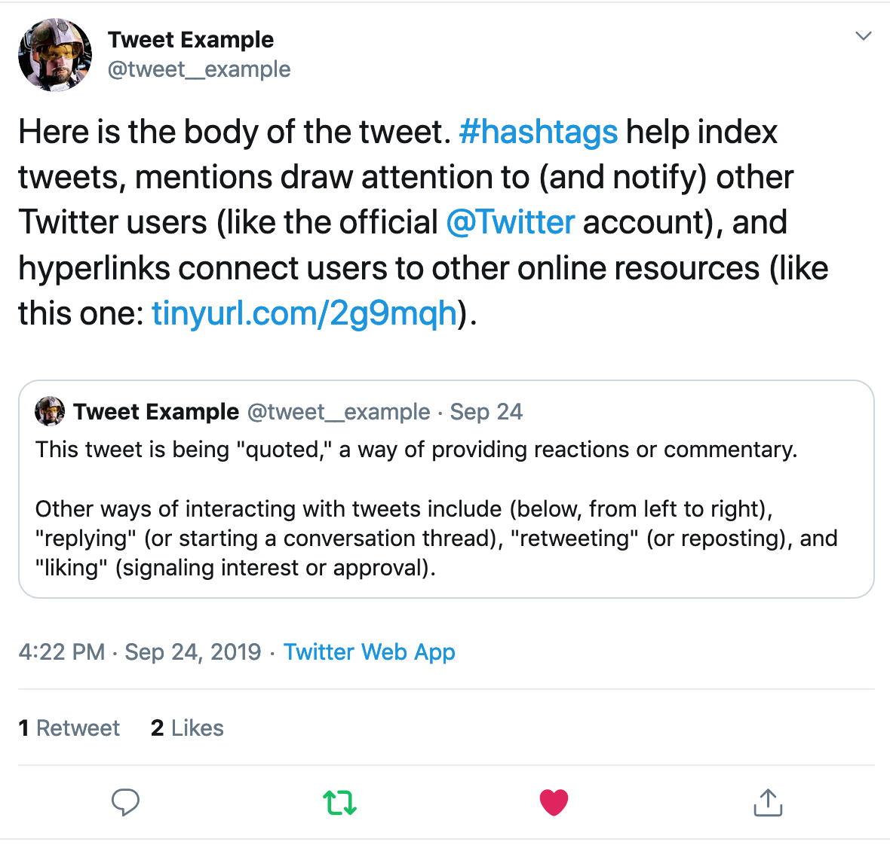
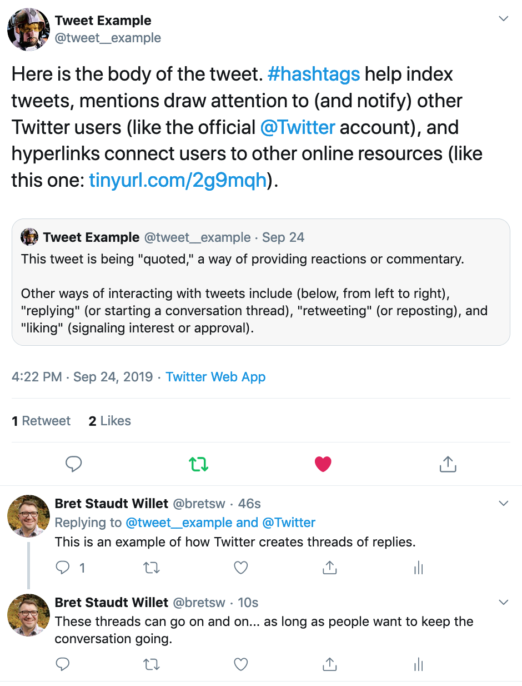
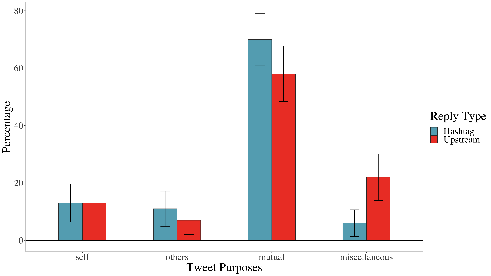
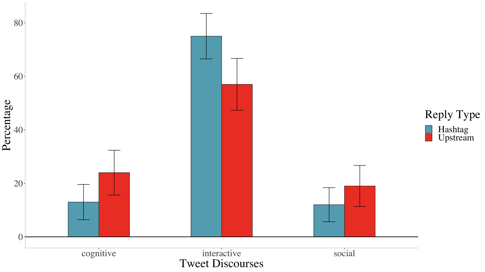
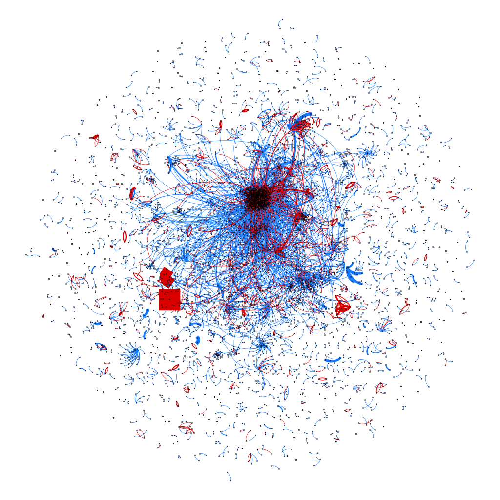

```{r setup, include=FALSE}
usethis::use_git_ignore(c("*.csv", "*.rds"))
options(htmltools.dir.version = FALSE)

# see options for customize slides: 
# https://slides.yihui.name/xaringan/
# https://slides.yihui.name/xaringan/incremental.html
# https://github.com/yihui/xaringan/wiki

library(tidyverse)
library(xaringan)
library(knitr)
library(kableExtra)
```

class: inverse, center, middle

# Slides

[bretsw.github.io/site20-twitter](https://bretsw.github.io/site20-twitter)

---

class: inverse, center, middle

 
# Thank you!

This research was funded in part by a

**Summer Renewable Research Fellowship (SRRF)**

Michigan State University, College of Education

---

class: inverse, center, middle

# Learning Together

---

# Learning Together

### Technology-related complications

More than just doing what you usually do, plus technology...

```{r, out.width = "600px", echo = FALSE, fig.align = "center"}

```

---

# Learning Together

### Education-related Twitter hashtags

```{r, out.width = "480px", echo = FALSE, fig.align = "center"}
include_graphics("img/learning.jpg")
```

--

1. Resources

--

1. Emotional support

--

1. Collaboration

---

# Learning Together

### Education-related Twitter hashtags

```{r, out.width = "300px", echo = FALSE, fig.align = "center"}

```

### \#Edchat

--

"...Twitter discussion that any educator can discuss and learn about current teaching trends, to integrate technology, to transform their education, and to connect with inspiring instructors around the world."

--

**Tuesdays 7:00-8:00pm EST**  
on Twitter

---

class: inverse, center, middle

# How might technology complicate how educators learn together?

In this case, how might the affordances of Twitter complicate things?

---

class: inverse, center, middle

# Affordances of Twitter

---

# Affordances of Twitter

### Media convergence: Kludge

```{r, out.width = "480px", echo = FALSE, fig.align = "center"}

```

--

1. Amount of content

--

1. Mishmash of content

--

1. Mashup of features

---

# Affordances of Twitter

### Tweets

```{r, out.width = "600px", echo = FALSE, fig.align = "center"}

```

---

# Affordances of Twitter

### Hashtags

```{r, out.width = "300px", echo = FALSE, fig.align = "center"}

```

--

**Many different uses!**

--

* topical index: #Teaching

--

* humor and wit: #CoolTeacher

--

* synchronous chats: #SatChat

--

* "space" for ongoing discussions: #Edchat, #ITeachMath

---

# Affordances of Twitter

### Threads

```{r, out.width = "420px", echo = FALSE, fig.align = "center"}

```

---

# Twitter Background

### Hashtag-thread mashup

```{r, out.width = "420px", echo = FALSE, fig.align = "center"}

```

---

# Affordances of Twitter

### Hashtag-thread mashup 

--

1. Hashtag replies

--

1. Upstream replies

--

1. Downstream replies

```{r, out.width = "300px", echo = FALSE, fig.align = "center"}

```

---

# Research Questions

```{r, out.width = "480", echo = FALSE, fig.align = "center"}
include_graphics("img/question.jpg")
```

--

1. How common are hashtag replies versus upstream replies?

--

1. How different, if at all, are hashtag replies and upstream replies?

---

class: inverse, center, middle

# Method

---

# Data Collection

```{r, out.width = "480", echo = FALSE, fig.align = "center"}

```

--

* I collected tweets with a `Twitter Archiving Google Sheet (TAGS)` (Hawksey, 2014)

--

  * all tweets containing the keyword text "#edchat"

--

  * October 1, 2017 to June 5, 2018 (8 months)

--

* I obtained tweet metadata using the `rtweet` R package (Kearney, 2018)

---

class: inverse, center, middle

# Results

---

# Results: RQ1

### How common are hashtag replies versus upstream replies?

--

* 13,176 total reply tweets from 3,672 tweeters

--

  * 10,433 hashtag replies (**79.18%**)
  * 2,743 upstream replies (**20.82%**)
  
--

* 2,364 (64.38%) composed only hashtag replies (i.e., they always included the #Edchat hashtag in their replies)

--

* 822 (22.39%) contributors composed only upstream replies

--

* 486 (13.24%) contributors composed both hashtag and upstream replies. 

---

# Results: RQ2

### How different, if at all, are hashtag replies and upstream replies?

--

**Table 1.** Comparing Tweets in the #Edchat Hashtag-Thread Mashup

```{r, eval=TRUE, echo= FALSE, message=FALSE}
table1 <- 
  read_csv("table-tall.csv", col_names = TRUE) %>%
  column_to_rownames("rowname")
row.names(table1) <- c("Synchronous %", "Self-reply %",
                           "Words per tweet", "Characters per tweet", 
                           "Sentiment", "Hashtags per tweet",
                           "Hyperlinks per tweet", "Likes per tweet", 
                           "Retweets per tweet", "Replies per tweet"
                           )
knitr::kable(table1, format = 'html', align='l',
             col.names=c("Hashtag Replies", "Upstream Replies"),
             row.names = TRUE
             ) %>%
  kable_styling(c('striped', 'bordered'))
```

---

# Results: RQ2

### How different, if at all, are hashtag replies and upstream replies?

--

**Figure 1.** Percentage of Tweet Purposes by Type of Reply 

```{r, out.width = "800", echo = FALSE, fig.align = "center"}

```

---

# Results: RQ2

### How different, if at all, are hashtag replies and upstream replies?

--

**Figure 2.** Percentage of Tweet Discourses by Type of Reply

```{r, out.width = "800", echo = FALSE, fig.align = "center"}

```

---

# Results: RQ2

### How different, if at all, are hashtag replies and upstream replies?

--

**Figure 3.** Visualization of Social Interactions in the #Edchat Affinity Space

```{r, out.width = "360px", echo = FALSE, fig.align = "center"}

```

###### Blue lines = hashtag replies; red lines = upstream replies

---

class: inverse, center, middle

# Discussion

---

# Discussion

### Multiple conversations in one space

```{r, out.width = "600px", echo = FALSE, fig.align = "center"}
include_graphics("img/multiple-conversations.jpg")
```

--

\#Edchat can simultaneously host a variety of conversation styles and topics

---

# Discussion

### Need for increased digital literacy

```{r, out.width = "560px", echo = FALSE, fig.align = "center"}

```

--

...because of Twitter’s dual kludge of **features** and **content** complicates learning together with this tool

---

# Discussion

### Research Like a Participant (#RLAP)

```{r, out.width = "560px", echo = FALSE, fig.align = "center"}

```

###### Photo credit: https://www.flickr.com/photos/larskflem/2472709843

--

...because how researchers conceptualize a concept has not always matched with how participants experience it

---

class: inverse, center, middle

# Conclusion

---

# Conclusion

### Technology complicates the social dimension of learning

```{r, out.width = "320px", echo = FALSE, fig.align = "center"}

```

--

* Here, we've looked at the **hashtag-thread mashup**, comparing hashtag replies to upstream replies

--

  * Including multiple hashtags ~ bringing multiple spaces together

--

  * Adding a hashtag at the end of a thread of replies ~ building a bridge to a past conversation

--

  * Dropping a hashtag in a thread of replies ~ walking out of the room where a conversation may still be happening
  
---

# Conclusion

### Technology complicates the social dimension of learning

```{r, out.width = "320px", echo = FALSE, fig.align = "center"}

```

* Important to pay attention to Twitter's features in addition to its content

---

class: inverse, center, top

# Hashtag-Thread Mashup

```{r, out.width = "720px", echo = FALSE, fig.align = "center"}
include_graphics("img/threads2.jpg")
```

---

class: inverse, left, top

# Questions?

* **Email:** [staudtwi@msu.edu](mailto:staudtwi@msu.edu)

* **Twitter:** [@bretsw](https://twitter.com/bretsw)

* **Web:** [bretsw.com](http://bretsw.com)

* **Slides:** [bretsw.github.io/site20-twitter](https://bretsw.github.io/site20-twitter)

* **R code:** [github.com/bretsw/edchat-interactions](https://github.com/bretsw/edchat-interactions)